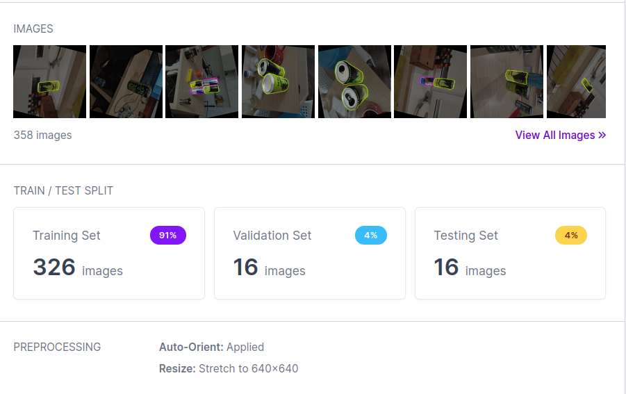
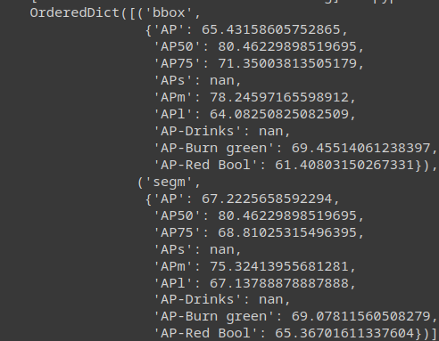
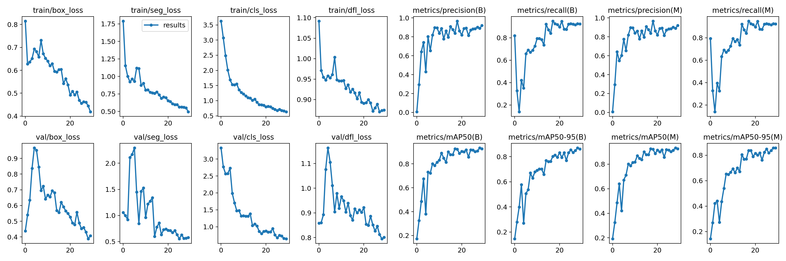
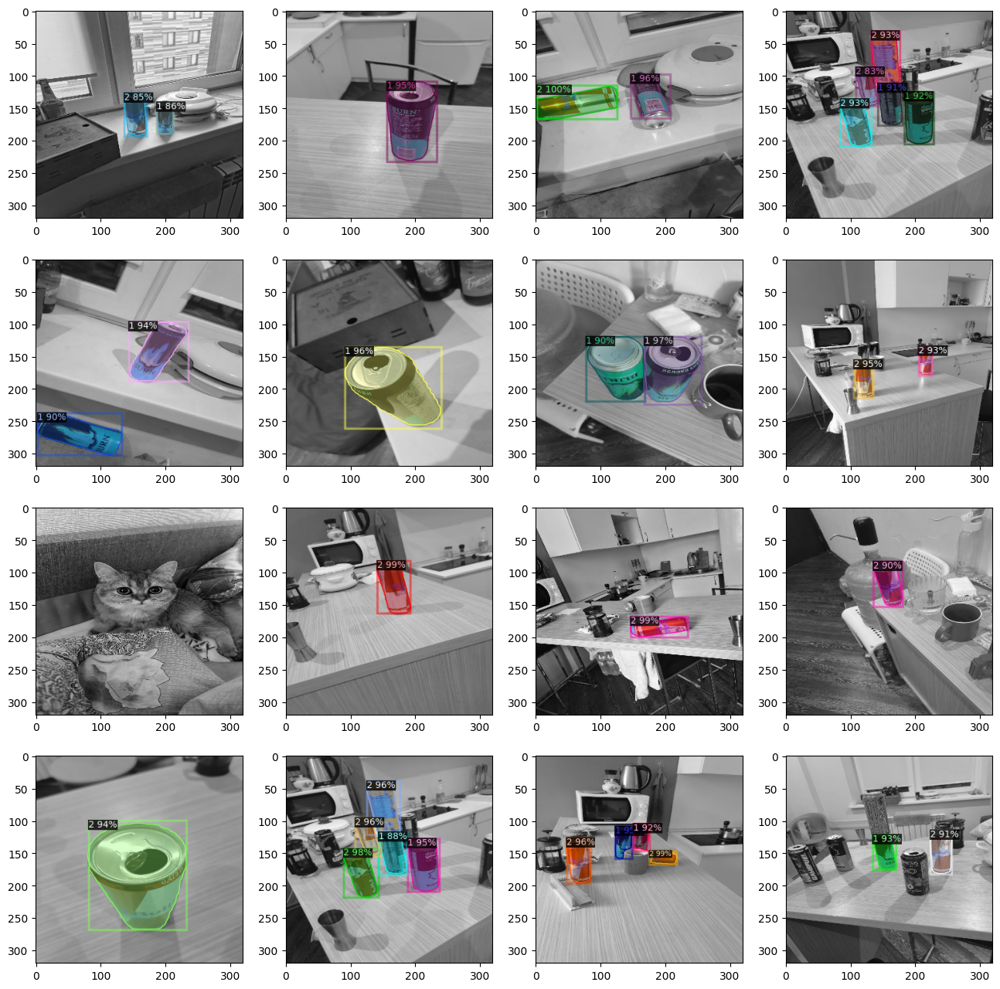
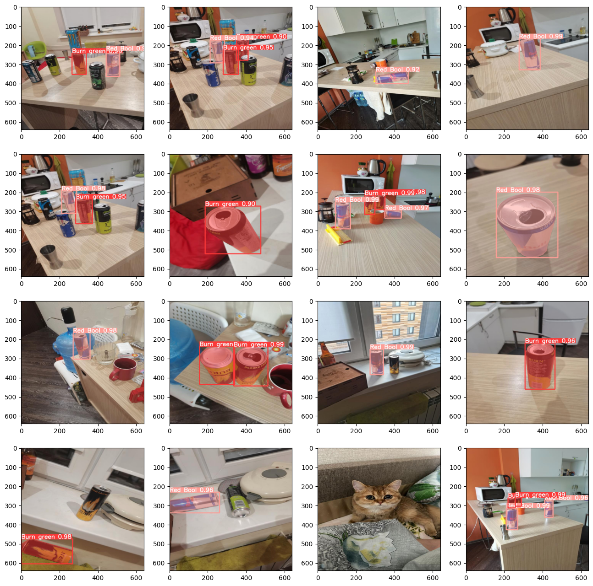

## 1) Prictures of the environment:
For this segmentation task, I used the same dataset as for the previous task. I took 141 photos of 2 different types of energy drinks (Green Burn and Red Bull). But for this task it's necessary to change the objective task from object detection to instance segmentation.
## 2) Annotate photos for the segmentation task:
For this task, I had to convert the bounding box annotations into the polygons for segmentation. Roboflow can do this automatically, so it's a much simpler step. After all the annotation and data augmentation I have the following results:

## 3)Training a Mask RCNN model using detectron2
For the Mask-RCNN  with the detecron2 I do the following steps:
-   Install the data set from Roboflow in COCO format.
```python
VERSION = 1
from roboflow import Roboflow
rf = Roboflow(api_key="i5a31149ZXb5vXFpPtOS")
project = rf.workspace("ds-sdvyu").project("aml_assignment2")
dataset = project.version(1).download("coco-segmentation")
```
-   Register COCO instances for training, test and validation data
```python
cfg = get_cfg()
cfg.merge_from_file(model_zoo.get_config_file("COCO-InstanceSegmentation/mask_rcnn_R_50_FPN_3x.yaml"))
cfg.DATASETS.TRAIN = ("dataset_train",) #Train dataset registered in a previous cell
cfg.DATASETS.TEST = ("dataset_test",) #Test dataset registered in a previous cell
cfg.DATALOADER.NUM_WORKERS = 2
cfg.MODEL.WEIGHTS = model_zoo.get_checkpoint_url("COCO-InstanceSegmentation/mask_rcnn_R_50_FPN_3x.yaml")
cfg.SOLVER.IMS_PER_BATCH = 2
cfg.SOLVER.BASE_LR = 0.00025
cfg.SOLVER.MAX_ITER = 10000
cfg.SOLVER.STEPS = []
cfg.MODEL.ROI_HEADS.BATCH_SIZE_PER_IMAGE = 512
cfg.MODEL.ROI_HEADS.NUM_CLASSES = 3 # 2 classes of drinks and 1 superclass
cfg.TEST.EVAL_PERIOD = 0 # i will not evaluate model during training to decrease training time
PATIENCE = 300 #Early stopping will occur after N iterations of no imporovement in total_loss
```
-   Define config for the model with all required parameters.
-   Create a COCO trainer with the generated config and train the faster RCNN from the model_zoo of the detectron.
-   Check the results of the model training in the test dataset The code of the training process can be found in the file `Mask_RCNN.ipynb` or with the following colab link [here](https://colab.research.google.com/github/naryst/EnergyDrinks_segmentation/blob/master/Mask_RCNN.ipynb)
## 4) Training YoloV8-nano for segmentation task:
-   Download the dataset specially prepared for the YoloV8 model using the roboflow API.
```python
from roboflow import Roboflow 
rf = Roboflow(api_key="i5a31149ZXb5vXFpPtOS") 
project = rf.workspace("ds-sdvyu").project("aml_assignment2") 
dataset = project.version(1).download("yolov8")
```
-   install the Yolo model with the ultralytics python lib
-   train Yolo on my custom dataset using the CLI command (it's just 1 line of code)
```shell
!yolo task=segment mode=train model=yolov8n-seg.pt data={dataset.location}/data.yaml epochs=30 imgsz=800 plots=True
```
-   Check the results of the model predictions on the validation and test datasets. Notebook with the code of YoloV8 training process can be found in the file `YoloV8.ipynb` by the following colab link [here](https://colab.research.google.com/drive/1v68zZk8oGCNqO5AWJpmm9xDTLDn0HpC4?usp=sharing)
## 5) Both models evaluation based on mAP and speed and size:

### mAP:
- For the mask-RCNN

- For the YoloV8-nano

### Speed:
- For mask-RCNN it took 9 mins for training
- For YoloV8-nano it took 0.144 hours (8.64 mins) for training
So, in terms of training speed it tooks pretty similar time.
### Size:
- 1890M of VRAM for mask-RCNN
- 4.49G of VRAM for YoloV8-nano
So, Yolo tooks 2 times more VRAM to train

### Model predictions on the test set:
Mask-RCNN on test set:


Yolo:


